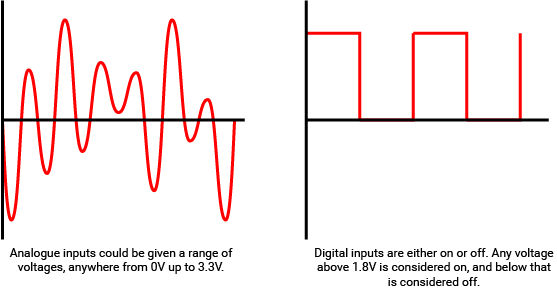

## Analogue inputs

In the world of electrical engineering, there are two type of input and output (I/O): analogue and digital. Digital I/O is fairly easy to understand; it's either *on* or *off*, *1* or *0*.

When talking about voltages and the Raspberry Pi, any input that is approximately below 1.8V is considered *off* and anything above 1.8V is considered *on*. For output, 0V is off and 3.3V is on.

Analogue I/O is a little trickier. With an analogue input, we can have a range of voltages from 0V up to 3.3V, and the Raspberry Pi is unable to detect exactly what that voltage is.

How, then, can we use a Raspberry Pi to determine the value of an analogue input, if it can only tell when the voltage to a GPIO pin goes above 1.8V?

### Using a capacitor for analogue inputs

Capacitors are electrical components that store charge.

When current is fed into a capacitor it will begin to store charge. The voltage across the capacitor will start off low, and increase as the charge builds up.

By putting a resistor in series with the capacitor, you can slow the speed at which it charges. With a high resistance, the capacitor will charge slowly, whereas a low resistance will let it charge quickly.

If you time how long it takes the capacitor's voltage to get over 1.8V (or be *on*), you can work out the resistance of the component in series with it.

