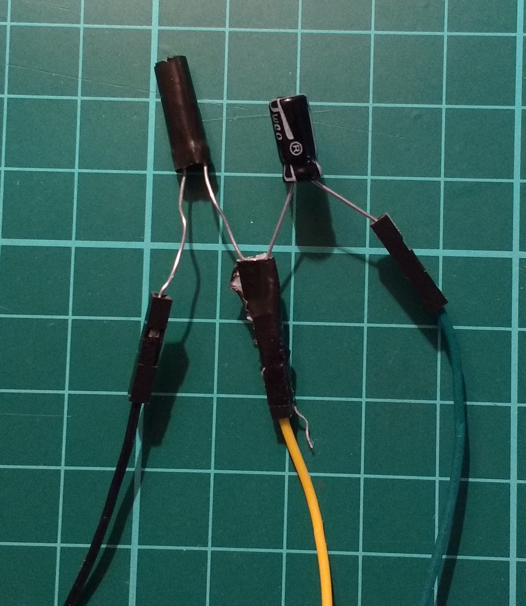
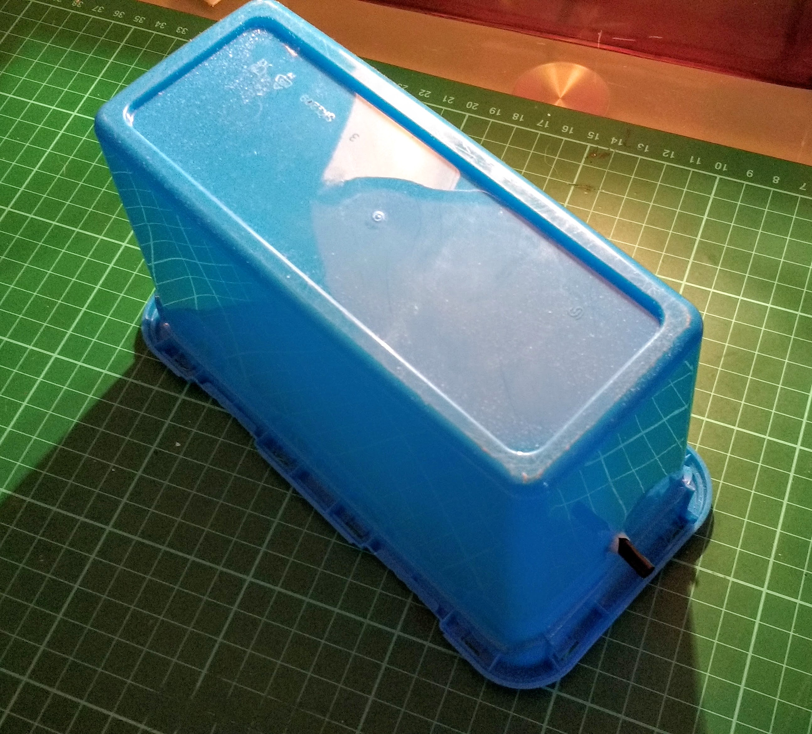

## Building your laser tripwire

Once the circuit has been tested, you can wire up the components directly to the Raspberry Pi as shown below.

1.  Place one leg of the LDR and the long leg of the capacitor into a female-to-female jumper lead. Then tape it up to secure the legs.

1.  Place the remaining legs into jumper leads, then plug it all back into the Raspberry Pi.

You can place the Raspberry Pi and components in a housing to conceal them if you wish. Here we have used a plastic box with a hole made in it for the straw:

1.  Place your container near a doorway. Then affix the laser pointer to the wall so the beam is focused down the straw.

1.  Now run the code and test your laser tripwire.

1. If you want to run your code as soon as the Raspberry Pi boots up, then have a look at the instructions below for automating tasks with **Cron**.

[[[nix-bash-crontab]]]
